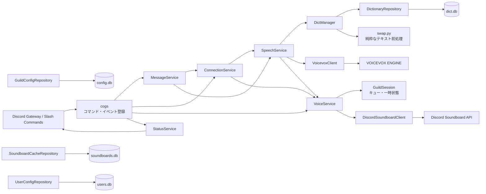
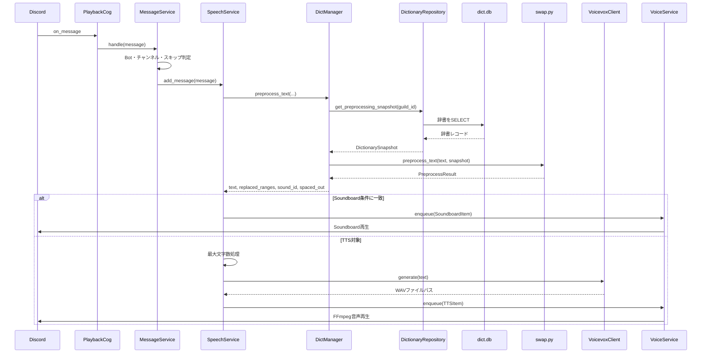
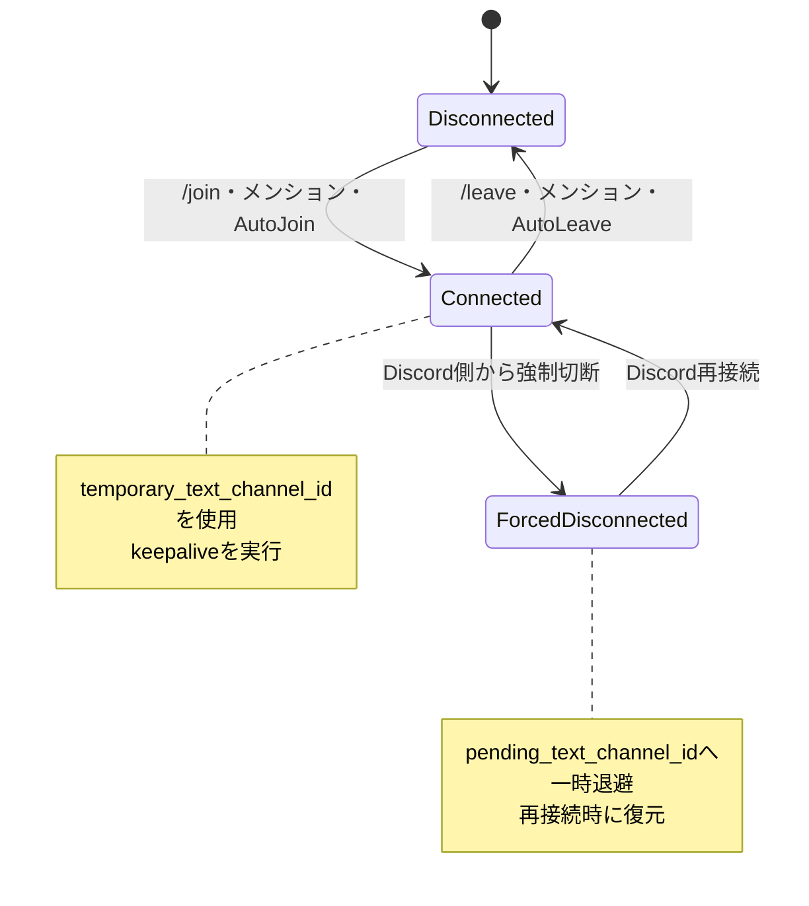

# Tsumugium v4.0.0.68 アーキテクチャ

v4.0.0.68は、Discord固有の登録処理、ユースケース、状態、外部通信、DB操作を分離しています。前処理結果APIとサーバー設定スキーマに破壊的変更があり、表示言語は日本語へ固定しています。

## 全体構成

この図の矢印は、主要な呼び出し・利用の方向を示します。戻り値による逆向きの矢印は省略し、処理中の往復は後述のシーケンス図で示します。

## レイヤーごとの責務

| レイヤー | 主な場所 | 責務 |
|---|---|---|
| Composition Root | `main.py` | オブジェクト生成、依存注入、Bot起動 |
| Discord登録層 | `cogs/`、`setting.py`、`word_dict.py`、`sound_dict.py` | コマンド・イベントを登録しService／Repositoryへ渡す |
| Service | `services/` | 接続、対象判定、音声生成判断、ユーザー読み方の解決、再生キュー管理 |
| Runtime Model | `models/` | キュー要素、ギルド単位状態、辞書スナップショット |
| Presentation | `presentation/` | 日本語Embedの共通ひな形とエラー応答 |
| Repository | `repositories/` | SQLiteの読み書きと既存スキーマ補完 |
| Client | `clients/` | VOICEVOX・Discord HTTP API、終了時のリソース解放 |
| Pure Processing | `swap.py` | DBやHTTPを持たないテキスト変換 |

依存方向は原則として、登録層 → Service → Repository / Client / Modelです。RepositoryとClientからDiscordコマンド層へは依存しません。

## メッセージから再生まで

読み上げの主要経路を示します。設定値の取得やエラー応答など、処理の理解に直接関係しない補助呼び出しは省略しています。

最大文字数の判定は`swap.py`の後に`SpeechService`が行います。優先辞書で保護された範囲の途中では切らず、その語の末尾まで残して「以下省略」を付けます。

空白区切りの同一文字反復と、異なる3文字以上の空白区切り部分列は文中でも連結します。メッセージ全文が異なる3文字以上を半角・全角スペース1つずつで区切った形式なら、連結後に`spaced_out=True`を設定します。通常文との混在時は連結だけを行い、`spaced_out=False`のまま通常の`Speed`を使用します。正規化はSoundboard辞書判定より前に行います。`SpeechService`はフラグ付き文章に`SpacedSpeed`を使用し、未設定（NULL）またはリセット後はデフォルト速度75を使用します。

### 音声生成・再生の一時障害

- 起動時はDiscord Gatewayへ接続する前にVOICEVOXの`/version`へHTTP疎通確認します。応答が得られない、2xx以外、または空の応答の場合は、起動中止理由をCLIへ1行で表示して終了します。
- `VoicevoxClient`は全ギルドの音声生成を1件ずつ処理します。タイムアウト・接続切断などの一時的な通信障害に限り、受付から最大30秒、0.5秒から最大5秒のバックオフを挟んで再試行します。一時切断後は所有するHTTPセッションを再生成し、HTTP 4xxなどの恒久エラーは再試行しません。
- `VoiceService`は再生中のTTSファイルを`GuildSession`で追跡します。`s`または`/clear instant`による意図的なFFmpeg停止はエラー通知せず、意図しない終了だけを通知します。

## 接続状態

自発的な切断は`ConnectionService.voluntary_disconnects`で識別し、一時読み上げチャンネルを破棄します。

## Discordステータス

`StatusService`は`STATUS_MESSAGE`を起動時に検証し、`{voice_connections}`、`{voice_users}`、`{guilds}`を現在のDiscordキャッシュから展開します。起動時は即時反映し、VC状態または参加サーバーが変化した場合は連続イベントを1秒間まとめて更新します。展開結果が変わらない場合はDiscord APIを呼びません。

## DB境界と互換性

| DB | 所有Repository | 用途 |
|---|---|---|
| `config.db` | `GuildConfigRepository` | サーバー設定 |
| `dict.db` | `DictionaryRepository` | 読み辞書・音声辞書 |
| `soundboards.db` | `SoundboardCacheRepository` | Soundboard候補キャッシュ |
| `users.db` | `UserConfigRepository` | サーバー横断のユーザー読みと、準備領域であるユーザー別個人辞書 |

- v4.0.0.68は`guild_config`へ`SpacedSpeed`を追加し、前処理APIを`PreprocessResult`へ変更します。v3へ戻す場合は移行前バックアップを使用してください。
- `guild_config.Language`は旧DB互換性のため残しますが、実行時には参照しません。
- 旧DBに不足する`Greeting`、`SpacedSpeed`、`full_match`、`trigger_user_id`は起動時に補完します。
- `SpacedSpeed`を追加する場合は、変更前の`config.db`を`backup_config_YYYYMMDD_HHMMSS_v3-latest.db`として先に保存します。バックアップに失敗した場合はDBを変更せず起動を中止し、移行前バックアップは通常ローテーションから除外します。
- Bot終了時は`ManagedDiscordClient`がHTTPセッションとSQLite接続を閉じます。
- `users.db`は起動時にテーブルを作成して定時バックアップ対象に含めます。`/user-reading`はギルドとDMの両方から本人の`reading`を更新し、常にephemeralで応答します。`UserReadingService`が保存済みの読み方をDiscordの表示名より優先する共通名前解決を提供し、メンションと入退室通知の双方から利用します。

## 変更時の注意点

- `swap.py`の前処理順序を変更する場合は、優先辞書・URL・カスタム絵文字・`www`の回帰テストを必ず実行してください。
- `GuildSession`以外へギルド単位の一時状態を増やさないでください。
- SQLをServiceやCogへ直接追加せず、対応するRepositoryへ置いてください。
- HTTP URL・認証ヘッダーをServiceへ直接追加せず、対応するClientへ置いてください。
- Embed本文は利用箇所でf-string等を使って組み立て、共通の外形だけを`make_embed()`へ任せてください。
