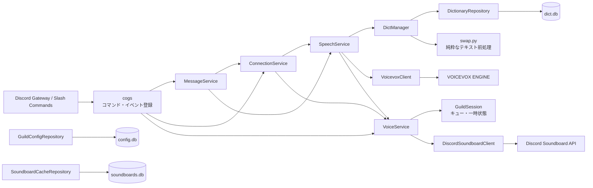
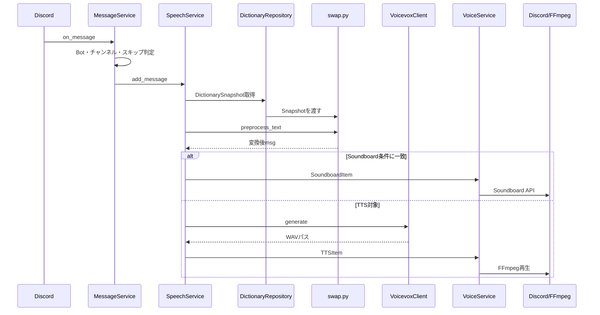
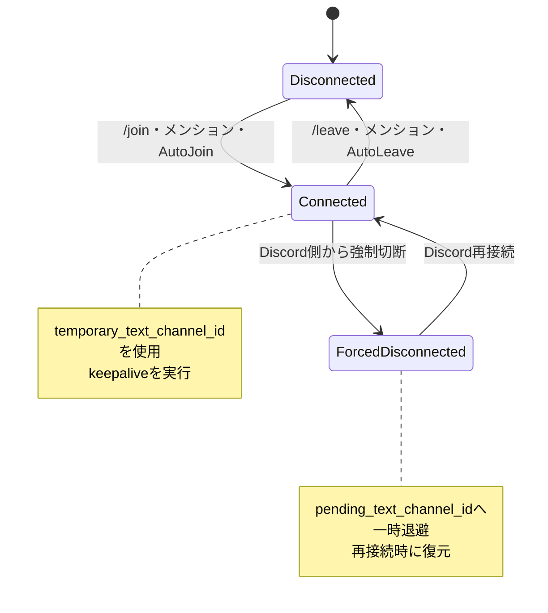

# Tsumugium v3.5 アーキテクチャ

v3.5は、Discord固有の登録処理、ユースケース、状態、外部通信、DB操作を分離しています。機能とv3系DBの互換性は維持し、表示言語は日本語へ固定しています。

## 全体構成

## レイヤーごとの責務

| レイヤー | 主な場所 | 責務 |
|---|---|---|
| Composition Root | `main.py` | オブジェクト生成、依存注入、Bot起動 |
| Discord登録層 | `cogs/`、`setting.py`、`word_dict.py`、`sound_dict.py` | コマンド・イベントを登録しServiceへ渡す |
| Service | `services/` | 接続、対象判定、音声生成判断、再生キュー管理 |
| Runtime Model | `models/` | キュー要素、ギルド単位状態、辞書スナップショット |
| Presentation | `presentation/` | 日本語Embedの共通ひな形とエラー応答 |
| Repository | `repositories/` | SQLiteの読み書きと既存スキーマ補完 |
| Client | `clients/` | VOICEVOX・Discord HTTP API、終了時のリソース解放 |
| Pure Processing | `swap.py` | DBやHTTPを持たないテキスト変換 |

依存方向は原則として、登録層 → Service → Repository / Client / Modelです。RepositoryとClientからDiscordコマンド層へは依存しません。

## メッセージから再生まで

最大文字数の判定は`swap.py`の後に`SpeechService`が行います。優先辞書で保護された範囲の途中では切らず、その語の末尾まで残して「以下省略」を付けます。

## 接続状態

自発的な切断は`ConnectionService.voluntary_disconnects`で識別し、一時読み上げチャンネルを破棄します。

## DB境界と互換性

| DB | 所有Repository | 用途 |
|---|---|---|
| `config.db` | `GuildConfigRepository` | サーバー設定 |
| `dict.db` | `DictionaryRepository` | 読み辞書・音声辞書 |
| `soundboards.db` | `SoundboardCacheRepository` | Soundboard候補キャッシュ |

- v3.5はテーブル名・主要カラム・主キーをv3系から変更しません。
- `guild_config.Language`は旧DB互換性のため残しますが、実行時には参照しません。
- 旧DBに不足する`Greeting`、`full_match`、`trigger_user_id`は起動時に補完します。
- Bot終了時は`ManagedDiscordClient`がHTTPセッションとSQLite接続を閉じます。

## 変更時の注意点

- `swap.py`の前処理順序を変更する場合は、優先辞書・URL・カスタム絵文字・`www`の回帰テストを必ず実行してください。
- `GuildSession`以外へギルド単位の一時状態を増やさないでください。
- SQLをServiceやCogへ直接追加せず、対応するRepositoryへ置いてください。
- HTTP URL・認証ヘッダーをServiceへ直接追加せず、対応するClientへ置いてください。
- Embed本文は利用箇所でf-string等を使って組み立て、共通の外形だけを`make_embed()`へ任せてください。
